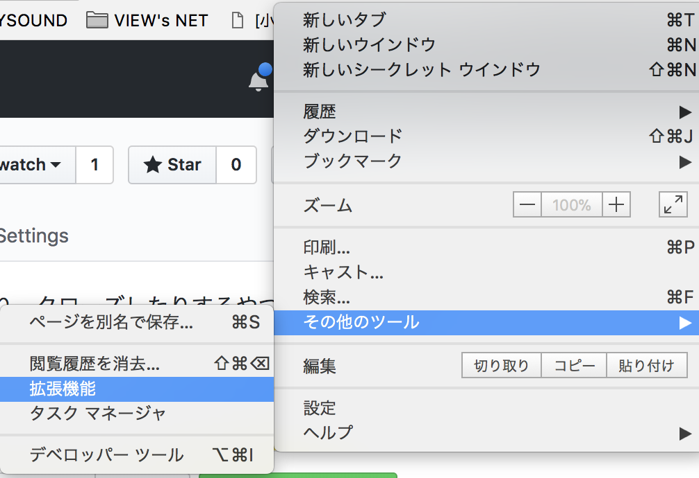
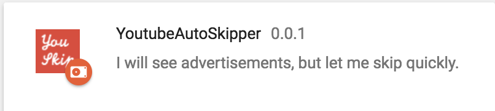

# youtube-auto-sikpper

Youtube の広告を根こそぎ消すのではなく、スキップボタンが表示されたら即時にスキップしたり、クローズしたりするやつ

## 使い方

### 1. 拡張機能の設定

Chrome の右上にあるメニューから [その他のツール] - [拡張機能] を押す.



### 2. デベロッパーモードに切り替える

どこかに「デベロッパーモード」があるので有効にする.

### 3. Chrome にインストール

「パッケージ化されていない拡張機能を読み込む」をクリック `YoutubeAutoSkipper` を選択する.

### 4. インストール成功確認



上の画像のように拡張機能が追加されていれば完了.

### 5. Youtube を開く

Youtube に行く.

https://www.youtube.com/

開いて拡張機能のアイコンが色づいたら実行されている.


上の画像のようになったら快適なYoutubeライフを送りましょう.

## なぜ作ったのか？

基本的にダラダラしているときに見ているのに
本編よりも長くてつまらない広告を流されたり ~~(コレやろ！)~~ 、続けて広告が２回も連続で表示されたりとスキップボタンを押さずに現状ギリギリ耐えられていた不快さが限界突破したから

リモコンでチャンネルを切り替えて逃げることもできず、リロードしても毎回表示される広告が健全なわけがないのだが、天下無慈悲な Google がやるから誰の文句も受け付けないし、いらんことして不快さが溜まっていくのは理解してたさ...その限界が今だとはね

## なぜ根こそぎ消さないのか

動画配信者が悪いわけではなく、広告プラットフォームと広告配信者に問題があるから
対価を受けるべき人に受けてもらいたい
とはいえ、過剰な広告は許゛さ゛ん゛

## 拡張機能をストアで公開しないのか？

金かかるし、Google にメリットがないので、BAN されそうなのでしません.

## LICENSE

```
Copyright 2018 tanjoin

Licensed under the Apache License, Version 2.0 (the "License");
you may not use this file except in compliance with the License.
You may obtain a copy of the License at

http://www.apache.org/licenses/LICENSE-2.0

Unless required by applicable law or agreed to in writing, software
distributed under the License is distributed on an "AS IS" BASIS,
WITHOUT WARRANTIES OR CONDITIONS OF ANY KIND, either express or implied.
See the License for the specific language governing permissions and
limitations under the License.
```
